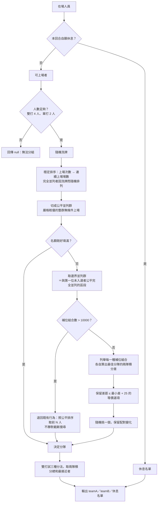

# badminton-matcher 羽球對戰分配機

打羽球時自動分組的純前端 PWA：公平輪替優先、強度平衡次之，對戰畫面直接給大家看，賽後記分並用 Glicko-2 追蹤每個人的強度。

正式站：<https://badminton-matcher.creticulata.dev>

## 功能

- **自動分組**：依當回合出席人數自動排出場與休息名單，休息次數盡量均等（公平輪替優先），再讓兩隊強度盡量接近
- **對戰畫面**：手機橫式四分割顯示兩隊對戰組合，每位參賽者有自訂代表色
- **計分與強度**：賽後輸入比分，以自行實作的 Glicko-2 更新強度分數。賽制已知時不只看勝負——由比分反推每球勝率再換算成勝率餵給 Glicko，15:13 與 15:0 不會給出相同的變動
- **賽制快照**：每場比賽凍結當下的賽制（目標分、需領先分數、分數上限），比分是否合法依該快照判定；不合賽制的比分可強制記錄，但不計入強度
- **級數顯示**：實力同時以積分與級數呈現（如 `1600（8.6 級）`）。級數就是 Glicko-2 的內部量 `mu` 平移 8 級，1 級 = 1 mu = 173.7178 積分，8 級 = 1500
- **手動調整**：自動分組後仍可手動換人，數據照手動結果計算
- **自願休息**：可標記本回合跳過某人
- **歷史紀錄**：每位實際上場者顯示單場 rating 增減，已結束活動可展開整日摘要；修改或刪除比分時從該活動固定開場狀態重播，不改寫下一活動的開場邊界
- **球員封存**：移除球員採可還原封存，保留既有比賽與 rating 歷史，但不再加入未來活動
- **CSV 匯出／匯入**：紀錄可存成 CSV 帶走或還原
- **壞資料不覆蓋**：本機資料讀不懂時進入唯讀的復原狀態並原樣保留，不會把空資料寫回去

## 自動分組流程

公平優先於強度平衡。強度只在「公平上完全並列」的人之間才有發言權——這是整個演算法唯一需要記住的一句話。



幾個刻意的設計：

- **公平鍵是「上場次數＋連續上場場數」**。次數少的優先；次數相同時，剛連打的人讓給沒連打的。
- **聯合決定「誰上場」與「怎麼分隊」**。在並列群裡逐一試每種補位組合，而不是先挑人再分隊——先挑人會把最好的分隊選項提前排除掉。
- **容差 25 內視為等價，隨機挑**。目的是配對變化，不是保護強弱極端者：後者由公平鍵負責，本輪被冷落者下一輪上場次數嚴格較低，會被無條件排入。
- **組合數爆炸時退回，不截斷**。截斷會讓不完整的搜尋看起來像完整的。

依據見 `docs/research/score-aware-margin-calibration.md`。

## 技術棧

Vue 3 + TypeScript + Vite + Tailwind CSS v4，無後端，資料存 localStorage（key: `badminton-matcher:v1`）。套件管理用 pnpm。

- 演算法純函式在 `src/lib/`，皆有 vitest 測試：
  - `glicko2.ts`：自行實作的 Glicko-2（tau 0.5），論文範例由測試鎖住；禁用第三方 glicko 套件
  - `matchmaking.ts`：上面那張圖
  - `endpoint-distribution.ts`：逐球模型的終局分布，把每球勝率換算成勝率
  - `scoring-format.ts`：賽制快照與合法終局判定
  - `level.ts`：積分與級數的換算
  - `rating-history.ts`、`persistence.ts`、`app-data-normalization.ts`、`migration.ts`、`csv.ts`、`color.ts`
- 全域 store 在 `src/store.ts`（Vue reactivity，非 pinia），UI 流程用 `ui.view` 切換，無 vue-router
- 規格見 `spec.md`，設計決策以 `design.md` 為準，領域詞彙見 `CONTEXT.md`
- 規格變更流程用 OpenSpec（`openspec/`），研究與離線佐證放 `docs/research/`，不進正式建置

## 開發

```bash
pnpm install
pnpm dev      # 開發伺服器
pnpm test     # vitest run
pnpm build    # vue-tsc -b && vite build
```

## 部署

GitHub push `main` 後由 Cloudflare Pages Git 整合自動建置部署（build: `pnpm build`、output: `dist`）。
