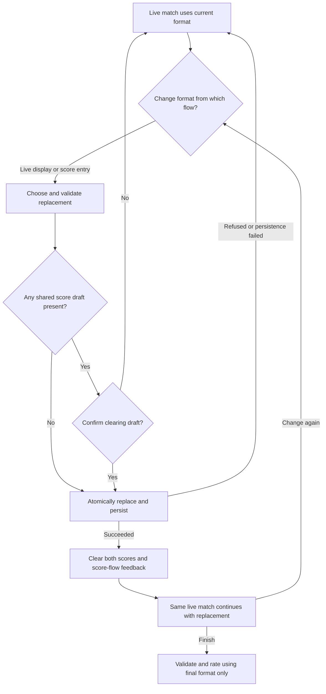
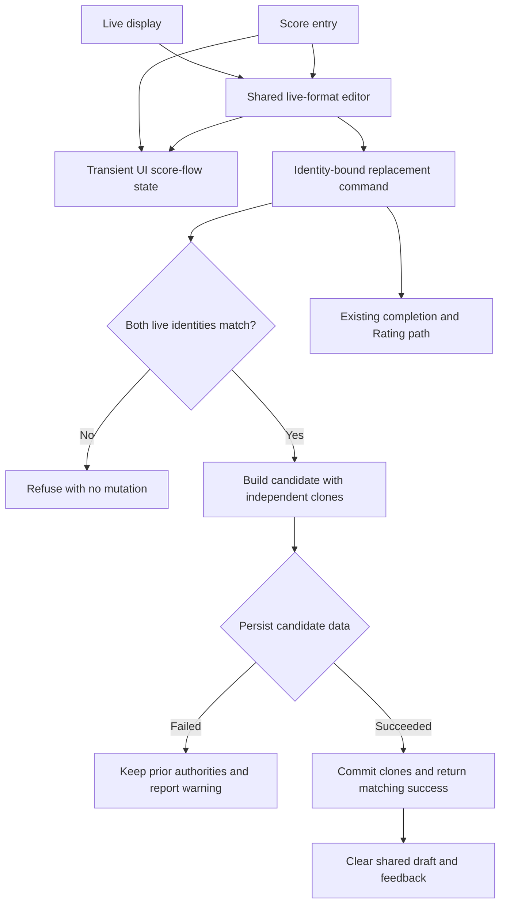

# Live Match Scoring Format Change - Plan

## Goal Capsule

- **Objective:** Allow an in-progress badminton match to shorten or extend its scoring format when court time changes, while preserving the same live match and lineup.
- **Product authority:** The final scoring format selected before completion is the sole format stored for the match and the sole format used for endpoint validation and Rating input.
- **Execution profile:** Strict vertical TDD in the isolated RW-56 worktree. Each behavior slice must produce an expected RED failure before its minimal GREEN implementation.
- **Stop conditions:** Stop rather than guess if durable rollback cannot preserve both live authorities, if a test requires changing persisted shapes, or if Rating, fairness, chronology, completed history, or session-default behavior changes.
- **Tail ownership:** Execution owns focused and full tests, production build guards, portrait and landscape browser acceptance, strict OpenSpec validation, and a fresh independent exact-tree review before closure.
- **Open blockers:** None.

---

## Product Contract

### Summary

Implement one identity-bound, durable live-format command and one shared transient score-flow state, then expose the same replacement editor from the live display and score entry.
The plan covers the full confirmed product scope and keeps adjacent persistence, Rating, fairness, and multi-tab concurrency changes out of the active diff.

### Problem Frame

Court availability can change after play begins.
A group may need to end a match earlier when little time remains or extend it when more time becomes available.
The current product freezes the scoring format at match start, forcing users either to record a final score against rules they no longer followed or cancel the match and lose its continuity.

### Key Decisions

- **Replace the live match's format rather than record a mixed-format timeline.** (session-settled: user-directed — chosen over an audited format transition or cancelling and restarting: the match should continue under rules adjusted for remaining court time.) Governs R1, R2, R4.
- **Keep the session default prospective.** (session-settled: user-approved — chosen over synchronizing the new format to later matches: a court-time adjustment is local to the current match.) Governs R3.
- **Protect entered score drafts without adding friction to blank forms.** (session-settled: user-approved — chosen over always confirming or always clearing silently: confirmation is needed only when score input would be lost.) Governs R6, R7.

### Requirements

**Live-match authority**

- R1. An in-progress match MUST allow its scoring format to be replaced before the match is completed.
- R2. The match MUST retain the same live-match identity, lineup, resters, start boundary, and fairness lineage when its scoring format changes.
- R3. A live-match format replacement MUST affect only the current match and MUST NOT change the session default or any later match.
- R4. The most recently saved live-match format MUST be the only format persisted on completion and the only format used for final-score legality and Rating observation.
- R5. A live match MAY replace its format repeatedly without a per-match limit until completion or cancellation.

**User interaction**

- R6. The format replacement action MUST be available from both the live-match display and the score-entry flow.
- R7. Score drafts and score-flow feedback MUST remain one shared transient live-match state when score entry is hidden. From either format-replacement entry point, when either score field contains a draft value, saving a different format MUST require confirmation that the draft will be cleared. Confirmation MUST clear both score fields, errors, and unrated-record prompts only after the authoritative replacement and its persistence succeed; declining or any replacement failure MUST preserve the saved format and complete score-flow state.
- R8. When both score fields are empty, saving a different format MUST apply without a score-clearing confirmation.
- R9. Cancelling the format picker MUST preserve the saved live-match format and any score draft unchanged.

**Durability and boundaries**

- R10. A live-match format replacement MUST commit only when browser persistence succeeds. The command MUST return a distinguishable success or refusal result, and persistence failure MUST roll both reactive and recoverable live snapshots back to their prior values, preserve the complete score draft, and expose the existing persistence warning. A successful replacement MUST survive recovery as the current format for that same live-match identity.
- R11. Completed-match formats MUST remain read-only; this change MUST NOT introduce historical format editing or format-transition history.
- R12. A format replacement MUST NOT change match participants, attendance events, fairness periods, completion chronology, session replay boundaries, or the Glicko-2 algorithm.
- R13. Shared transient score-flow state MUST be bound to one live-match identity. Switching visibility between score entry and the live display for that identity MUST retain the state, while replacing or removing the active live context with a different identity through cancellation, completion, session replacement, import, or recovery MUST clear it before the new live match can use score entry or format replacement.

### Key Flows

- F1. Live-display replacement
  - **Trigger:** A user needs to shorten or extend an in-progress match from the live display, including after returning from score entry with a retained draft.
  - **Steps:** Open the format action, select any supported catalog, custom, or explicit-unknown format, protect any shared score draft with the same confirmation protocol as score entry, and save it through the authoritative store command.
  - **Outcome:** The same match continues under the replacement per R1–R5.
  - **Covered by:** R1, R2, R3, R5, R6, R7, R8, R9, R10.

- F2. Score-entry replacement with a draft
  - **Trigger:** A user changes the format after entering one or both scores.
  - **Steps:** Save a replacement, review the clearing warning, and confirm or decline.
  - **Outcome:** Confirmation clears the draft only after replacement and persistence succeed; declining or command failure preserves the prior state per R7 and R9.
  - **Covered by:** R4, R6, R7, R9.

- F3. Match completion after replacement
  - **Trigger:** A user submits the final score after one or more format replacements.
  - **Steps:** Validate the endpoint against the final saved format and complete through the existing rated or deliberate-unrated path.
  - **Outcome:** History and Rating use only the final format per R4, while unrelated authority remains unchanged per R12.
  - **Covered by:** R4, R11, R12.

### Acceptance Examples

- AE1. **Covers R1–R4.** Given a live match started as 21 points, when the user replaces it with 15 points from the live display and later records a legal 15-point endpoint, then the same match completes with only the 15-point format and Rating uses that format.
- AE2. **Covers R3.** Given a session default of 21 points, when the current live match changes to 15 points, then the next proposed match still inherits 21 points.
- AE3. **Covers R5.** Given a live match changed from 21 to 15 points, when the user later changes it back to 21 before completion, then the second replacement succeeds and only 21 points remains authoritative.
- AE4. **Covers R6–R8.** Given score entry contains `10` and `5`, when the user returns to the live display, saves a new format there, and confirms the warning, then the authoritative replacement persists before both fields and score-flow feedback clear.
- AE5. **Covers R7, R9.** Given a non-empty score draft, when the user declines the clearing confirmation or cancels the picker, then the previous format and complete draft state remain unchanged.
- AE6. **Covers R8.** Given both score fields are empty, when the user saves a new format, then it applies without a clearing warning.
- AE7. **Covers R10.** Given a saved live-format replacement, when the application reloads before completion, then the recovered live match displays and completes under the replacement.
- AE8. **Covers R11, R12.** Given a completed match, when the user views history, then no format-edit action or transition log is offered and the existing replay and fairness boundaries remain unchanged.
- AE9. **Covers R7, R10.** Given a non-empty score draft and a persistence write failure, when the user confirms a replacement, then the command reports failure, both live authorities retain the prior format, the complete draft remains, and the persistence warning is visible; reloading recovers the prior format.
- AE10. **Covers R10.** Given the replacement targets a stale or mismatched live-match identity, when the store command runs, then it refuses without changing either live authority or any score draft.
- AE11. **Covers R13.** Given a score draft belongs to one live match, when a successful import or recovery replaces the active live context with a different identity, then the new match inherits no raw score, validation error, or force-unrated feedback; hiding and showing the same identity still retains its draft.

### Scope Boundaries

- No completed-match format editing or historical reinterpretation.
- No audit trail for prior live formats, transition timestamps, or on-court scores at the moment of change.
- No durable point-by-point or live score tracking; the existing score draft becomes shared transient UI state only and remains excluded from persistence and recovery.
- No automatic update to the session default or future matches.
- No changes to lineup authority, fairness periods, attendance, matchmaking priority, Glicko-2 equations, or replay boundaries.

### Dependencies and Assumptions

- Existing catalog, custom, and explicit-unknown formats remain the complete set of selectable variants.
- Existing endpoint validation, deliberate unrated recording, persistence recovery, and Rating calculation remain authoritative after the final live format is selected.

---

## Planning Contract

### Key Technical Decisions

- KTD1. **Use one identity-bound durable store command with persistence-before-mutation.** (session-settled: user-approved — chosen over in-memory success with a later persistence warning: score drafts must not be cleared until the replacement is durable.) The caller supplies the expected live-match identity. The command validates both authorities, builds a candidate application-data value containing independent replacement clones, and attempts to persist that candidate before mutating reactive state. A failed write therefore leaves both live authorities unchanged and schedules no deep-watch retry; the failure warning remains visible. After candidate persistence succeeds, the command commits the matching reactive and recoverable clones and returns a discriminated success result. The existing deep watcher may later perform an idempotent write of the same committed state. Governs R2, R7, R10.
- KTD2. **Place identity-bound score-flow fields in the existing non-persisted UI state.** The store already separates `ui` flow state from persisted `data`. Moving the owning live-match ID, both raw scores, and the validation message there lets both mounted overlays inspect one draft without changing `AppData`, migration, CSV, or recovery. Access first reconciles ownership against the active live identity: the same identity retains the state across visibility changes, while any different or absent identity clears it. The force-unrated offer remains derived from the shared fields and current format. Governs R6–R9, R13.
- KTD3. **Wrap the existing picker with one live-replacement coordinator.** A bounded live-format editor component owns picker visibility, confirmation, identity reconciliation, command invocation, result matching, and success-only draft clearing. Both surfaces render this coordinator rather than reimplementing the protocol. Governs R5–R9, R13.
- KTD4. **Deliver vertical RED→GREEN slices.** Each unit begins with one focused behavioral test, records the expected missing-behavior failure, adds only enough production code to pass, and runs its focused regression set before the next unit. This replaces a horizontal “all tests, then all code” sequence.

### High-Level Technical Design

The command owns the only state-changing boundary. UI confirmation occurs before the command. Draft clearing occurs after a success result for the expected live-match identity. Normal completion continues to copy the current live snapshot into the completed match and then uses the existing endpoint and Rating paths.

### Implementation Constraints

- Keep persisted `AppData`, `Session`, `MatchContext`, `Match`, CSV, normalization, and migration shapes unchanged.
- Preserve `startedAt: 0`, fairness-period IDs, wildcard lineage, lineup arrays, resters, mode, and live-match ID exactly across replacement and rollback.
- Do not mutate a retained scoring-format object. Clone every snapshot and every restored live context that crosses an authority boundary.
- Do not weaken `recoveryState` blocking or the global persistence warning.
- Do not change `DEFAULT_FAIRNESS_BAND`, wildcard release authority, matchmaking priority, Glicko-2 equations, replay boundaries, or completed-match edit rules.
- Do not add cross-tab localStorage coordination. Single-tab stale and mismatched live identities fail closed.

### Sequencing

Implement U1 through U5 in order. U1 establishes the command contract. U2 strengthens its durability boundary. U3 moves existing score-entry state without adding replacement UI. U4 proves the complete score-entry vertical path. U5 adds live-display parity against the same coordinator. U6 is closure-only and may begin after U5.

---

## Implementation Units

### U1. Identity-bound live-format command

- **Goal:** Establish the smallest successful store path for replacing one live snapshot without changing any other live or session authority.
- **Requirements:** R1–R5, R10, R12; AE1–AE3, AE10; KTD1, KTD4.
- **Files:** `src/store.ts`, `src/types.ts` only if a shared result type is needed, and a bounded store test in `src/scoring-format-gating.test.ts` or `src/live-scoring-format-change.test.ts`.
- **Approach:** Start with a test for a matching live identity and successful persistence. Assert a discriminated success result, independent cloned snapshots in both authorities, exact preservation of non-format fields including `startedAt: 0`, `fairnessPeriodIds`, wildcard lineage, lineup, resters, mode, and live-match ID, plus unchanged attendance events, completion-sequence state, cooldown, and session default. Add refusal cases incrementally for blocked, missing, stale, and mutually inconsistent live authorities; each refusal preserves bytes and performs no persistence write.
- **Test scenarios:** Successful 21→15 replacement; no alias to caller input; byte-equivalent non-format session and live authority; stale expected identity; missing reactive or recoverable live; mismatched authority identities; blocked recovery state.
- **Verification:** The focused store test fails for the missing command, then passes with no changes to existing scoring-format gating tests.

### U2. Durable commit and rollback

- **Goal:** Make command success mean that the replacement is already recoverable from localStorage.
- **Requirements:** R7, R10; AE7, AE9; KTD1, KTD4.
- **Dependencies:** U1.
- **Files:** `src/store.ts`, `src/store-recovery.test.ts`, `src/lib/__tests__/persistence.test.ts`, and `src/persistence-warning.test.ts` if warning rendering needs a direct assertion.
- **Approach:** Add a successful reload tracer first. Refactor persistence only as far as needed to write a validated candidate `AppData` value through the existing backup and warning boundary. Then inject a first-write-only failure and assert command refusal, unchanged in-memory authorities, unchanged persisted bytes, and a warning that remains visible after Vue flushes queued work. Prove no deep-watch retry was scheduled by the rejected candidate. Reload and confirm the old format remains authoritative. A later explicit user retry may succeed after storage recovers.
- **Test scenarios:** Persisted replacement reloads; persistent quota failure leaves all state unchanged; first write throws while a hypothetical later write would succeed but no automatic retry runs; warning remains visible through `nextTick`; later explicit retry succeeds; successful command commits independent clones.
- **Verification:** Persistence and recovery tests pass with the original storage schema and migration tests unchanged.

### U3. Shared transient score-flow state

- **Goal:** Give both format entry points one non-persisted view of score drafts and feedback while preserving existing score submission behavior.
- **Requirements:** R6–R9, R13; AE4–AE6, AE11; KTD2, KTD4.
- **Dependencies:** U1.
- **Files:** `src/store.ts`, `src/components/ScoreInput.vue`, and a bounded mounted score-flow test such as `src/live-scoring-format-ui.test.ts`.
- **Approach:** Move the owning live-match ID, raw A/B values, and validation error from component-local refs into `ui`. Keep force-unrated eligibility derived. Reconcile ownership whenever a score-flow action reads the state and at every boundary that creates, replaces, imports, recovers, completes, or removes the active live context. Hiding score entry for the same identity retains the draft; a different or absent identity clears it before use; no score-flow field enters persisted `data`.
- **Test scenarios:** Draft survives return to live display for the same identity; validation and force-unrated behavior match the current component; successful submission clears; failed submission retains; cancellation and completion clear; reload does not restore a draft; successful CSV/checkpoint import or recovery to a different live identity clears raw scores, validation error, and force-unrated feedback.
- **Verification:** Existing unrated and score validation tests remain green before adding format replacement UI.

### U4. Score-entry replacement vertical path

- **Goal:** Complete one end-to-end replacement path through score entry before adding the second surface.
- **Requirements:** R1, R4–R10, R13; AE3, AE5–AE7, AE9, AE11; KTD1–KTD4.
- **Dependencies:** U1–U3.
- **Files:** `src/components/ScoringFormatPicker.vue` only if its generic API needs a backward-compatible adjustment, new `src/components/LiveScoringFormatEditor.vue`, `src/components/ScoreInput.vue`, and `src/live-scoring-format-ui.test.ts`.
- **Approach:** Mount the shared live editor in score entry. A blank draft invokes the command without confirmation. A non-empty draft confirms first. Only a matching durable success closes the editor and clears shared fields; picker cancel, declined confirmation, stale identity, blocked state, and persistence refusal preserve format and complete score-flow state.
- **Test scenarios:** Blank direct switch; non-empty accept; non-empty decline; picker cancel; same-format save has no destructive clearing; store refusal after confirmation; unlimited second replacement; final endpoint uses the latest format.
- **Verification:** The mounted score-entry test and focused store/persistence tests pass together before touching the live display.

### U5. Live-display parity and mobile-safe entry

- **Goal:** Expose the same editor from the live overlay without duplicating confirmation or authority logic.
- **Requirements:** R1–R10, R13; AE1, AE4, AE5, AE10, AE11; KTD2–KTD4.
- **Dependencies:** U4.
- **Files:** `src/components/MatchDisplay.vue`, `src/components/LiveScoringFormatEditor.vue`, and `src/live-scoring-format-ui.test.ts`.
- **Approach:** Add a secondary live-format action that fits beside cancel and score-entry controls in portrait and landscape. Use the same editor instance contract. Prove a draft entered in score entry, retained after returning, triggers confirmation from the live display and clears only after durable success.
- **Test scenarios:** Live-display blank switch; retained-draft accept and decline; picker cancel; failure preservation; both surfaces immediately render the same current format; cancel and score-entry controls remain available.
- **Verification:** Mounted parity tests pass without text-only snapshots, and no reset or wildcard controls reappear in the live overlay.

### U6. Authority closure and acceptance

- **Goal:** Prove RW-56 changes only current live-format authority and is ready for independent review.
- **Requirements:** R1–R13; AE1–AE11.
- **Dependencies:** U5.
- **Files:** Existing focused tests, OpenSpec tasks, and browser acceptance evidence; production files change only if a failing closure test exposes a scoped defect, in which case restart RED→GREEN for that defect.
- **Approach:** Run focused non-interference tests, the full suite, build guards, and strict OpenSpec validation. Exercise portrait and landscape flows in a headed browser. Compare the final delta against the exact worktree tree, then obtain a fresh independent review. Resolve every P0–P3 production finding and rerun affected gates.
- **Test scenarios:** Final-only history; next match retains default; rated and deliberate-unrated completion; exact fairness lineage, attendance events, completion sequence, cooldown, and wildcard release authority remain unchanged; persistence warning path; imported/recovered live identity cannot inherit an old transient draft; completed match has no format editor; page and console remain error-free.
- **Verification:** All Verification Contract gates and the Definition of Done pass on the final tree.

---

## Verification Contract

| Gate | Command or evidence | Applies to | Pass condition |
|---|---|---|---|
| Store and recovery RED/GREEN | `npm exec --yes --package=pnpm@11.22.0 -- pnpm vitest run src/scoring-format-gating.test.ts src/live-scoring-format-change.test.ts src/store-recovery.test.ts src/lib/__tests__/persistence.test.ts src/persistence-warning.test.ts` | U1, U2 | Each new behavior was first observed failing for the expected missing behavior; final run is green. Omit a proposed new filename only if its tests land in an existing bounded file. |
| Mounted UI RED/GREEN | `npm exec --yes --package=pnpm@11.22.0 -- pnpm vitest run src/live-scoring-format-ui.test.ts src/session-fairness-display.test.ts src/session-fairness-mounted.test.ts src/unrated-match.test.ts` | U3–U5 | Both entry points, same-identity draft retention, different-identity clearing, refusal preservation, and success-only clearing pass against mounted components. |
| Rating and format non-interference | `npm exec --yes --package=pnpm@11.22.0 -- pnpm vitest run src/lib/__tests__/scoring-format.test.ts src/lib/__tests__/performance-score.test.ts src/lib/__tests__/glicko2.test.ts src/lib/__tests__/rating-history.test.ts src/lib/__tests__/app-data-normalization.test.ts src/unrated-match.test.ts` | U1–U6 | Final format governs existing endpoint and Rating paths; no equation, replay, normalization, or unrated regression. |
| Fairness, chronology, and release non-interference | `npm exec --yes --package=pnpm@11.22.0 -- pnpm vitest run src/store.test.ts src/lib/__tests__/rotation-fairness.test.ts src/lib/__tests__/rotation-chronology.test.ts src/lib/__tests__/rotation-wildcard-release.test.ts src/lib/__tests__/rotation-wildcard-non-interference.test.ts src/session-fairness-display.test.ts src/session-fairness-mounted.test.ts` | U1, U2, U6 | Exact before/after assertions and focused suites preserve fairness lineage, attendance, chronology, cooldown, matchmaking priority, and unreleased wildcard authority. |
| Full regression | `npm exec --yes --package=pnpm@11.22.0 -- pnpm test` | U6 | Entire Vitest suite passes with no unexpected warnings or skipped RW-56 behavior. |
| Production build guards | `npm exec --yes --package=pnpm@11.22.0 -- pnpm build` | U6 | Typecheck, Vite build, production isolation, and release-authority verification all pass; wildcard generation remains unreleased. |
| Specification closure | `openspec validate allow-live-match-scoring-format-change --strict --no-interactive` and `git diff --check` | U6 | OpenSpec is valid and the diff has no whitespace errors. Before archive, verify the explicit scenario migration map: “Match uses an override” maps to “Match uses a pre-start override”; “Default changes during a live match” maps to “Session default changes during a live match”; “Override is attempted after outcome entry begins” is intentionally removed and replaced by the live-replacement and deliberate-draft scenarios. Every unrelated base scenario must retain its exact name and meaning. |
| Browser acceptance | Headed browser at 390×844 and 844×390 | U5, U6 | Both entries work; accept/decline/failure preserve the specified state; final completion and next-match default are correct; controls are unobscured; page and console show no errors. |
| Independent review | Fresh exact-tree reviewer after the final production change | U6 | No unresolved P0–P3 findings. Any production fix invalidates the receipt and requires a fresh review. |

---

## Definition of Done

### Global

- Every new production behavior has a recorded expected RED failure followed by a focused GREEN result.
- All OpenSpec tasks are checked only after their behavior and verification evidence exist.
- The replacement command returns success only for the expected live identity after durable persistence; all refusals are mutation-safe.
- Both UI entries share one identity-bound transient draft protocol. The same live identity retains it across visibility changes; a replacement or removal boundary clears it; format replacement clears it only after matching durable success.
- Completed history stores only the final format. Session defaults, later matches, Rating, fairness, chronology, replay, migration, CSV, and wildcard release authority remain unchanged.
- Focused tests, full suite, production build guards, strict OpenSpec validation, diff check, mobile browser acceptance, and final independent review pass on the final tree.
- No abandoned experiments, duplicate replacement coordinators, obsolete comments about post-start immutability, or unrelated refactors remain in the diff.

### Per Unit

- U1 is done when success and all identity/recovery refusals have exact store assertions and no partial mutation.
- U2 is done when success reloads the new format and write failure rolls back, warns, and reloads the old format.
- U3 is done when score-flow state is shared and identity-bound but absent from persisted data, same-identity visibility changes retain it, and every live-identity replacement/removal boundary clears it.
- U4 is done when score-entry replacement satisfies blank, confirm, decline, cancel, repeat, and refusal paths.
- U5 is done when live-display behavior is equivalent, cross-entry draft protection is proven, and mobile controls remain usable.
- U6 is done when every gate above passes and the fresh independent reviewer reports no unresolved P0–P3 finding.
